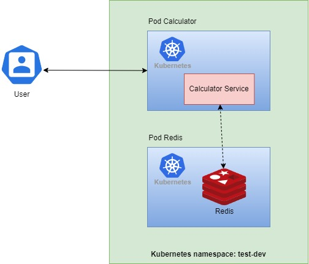

# calculator_api
Go Redis Calculator

# lib
- github.com/gofiber/fiber/v2
- github.com/go-redis/redis/v9

โครงสร้างของโปรเจคนี้จะแบ่งเป็นสองส่วนคือ 
1. ส่วนของ Service Calculator
2. ส่วของ Redis
Service Calulator ของเรานั้นจะทำการเชื่อต่อกับ Redis ซึ่งจะอธิบายที่ละ Step ดังนี้:
- สร้าง ConfigMap ของ Redis ขึ้นมาซึ่งเราจะเอา config ตัวนี้ไปใช้กลับ Redis
- ทำการ Deploy Redis ขึ้นไปบน Kubernetes ก่อนพร้อมกับทำ Service Type=ClusterIP
- source code ของเราจะมีส่วนที่ทำการติดต่อกับ Redis ซึ่งต้องเป็น Redis ที่ Deploy อยู่บน Kubernetes
- ในที่นี้เราจะทำแบบไม่ Best Practise เท่าไหร่เราจะไปเอา Cluster IP ของ Service Redis มาโดยตรง
- พิมพ์ Kubectl get service -n test-dev ซึ่ง test-dev เป็น namespace ที่เราทำการ Deploy ลงไป
- เอา ClusterIP และ Port ที่ได้ไปใส่ใน Addr ที่จะติดต่อกับ Redis ใน code
- ทำการ Build Docker image ขึ้นมาซึ่งในที่นี้สร้างเป็น calculator:go-dev
- พิมพ์ docker build -t calculator:go-dev .
- เมื่อได้ images ของ calculator แล้วจะทำการ Deploy ลง Kubernetes
- ทำการ Deploy Calculator ลงไปใน Kubenetes โดยมี Service Type=NodePort
- พิมพ์ Kubectl get service -n test-dev แล้วดูว่า service ของ Calculator เปิด Port อะไร

# curl
- curl localhost:{port-calculator-service}/plus -H 'content-type:application/json' -d '{"setter":5, "action":5}' -X GET
- curl localhost:{port-calculator-service}/minus -H 'content-type:application/json' -d '{"setter":5, "action":5}' -X GET
- curl localhost:{port-calculator-service}/multiply -H 'content-type:application/json' -d '{"setter":5, "action":5}' -X GET
- curl localhost:{port-calculator-service}/divide -H 'content-type:application/json' -d '{"setter":5, "action":5}' -X GET
- curl localhost:{port-calculator-service}/calculate -H 'content-type:application/json' -d '{"operator": "+","num1":5,"num2":5}' -X GET